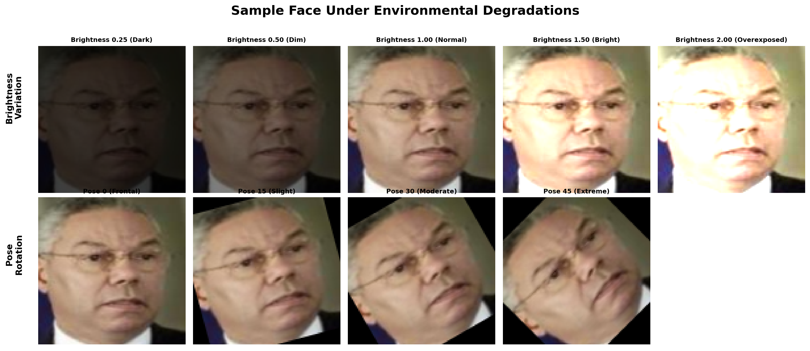
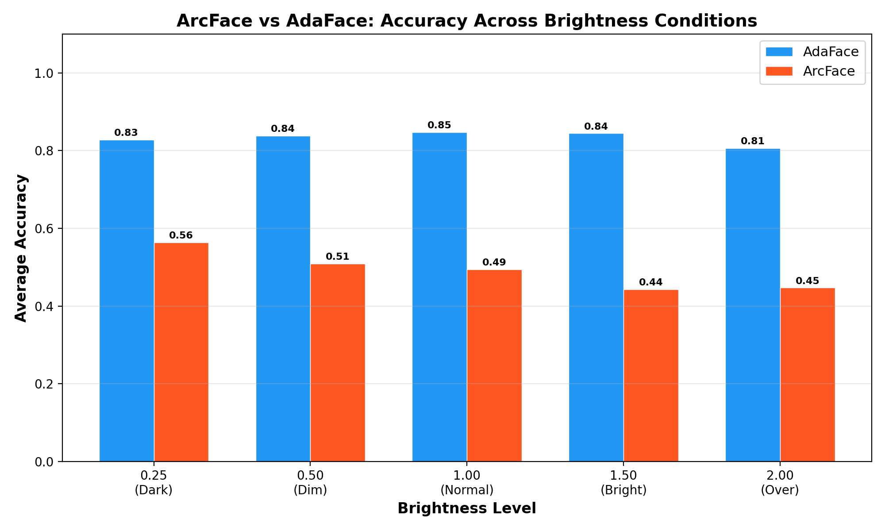
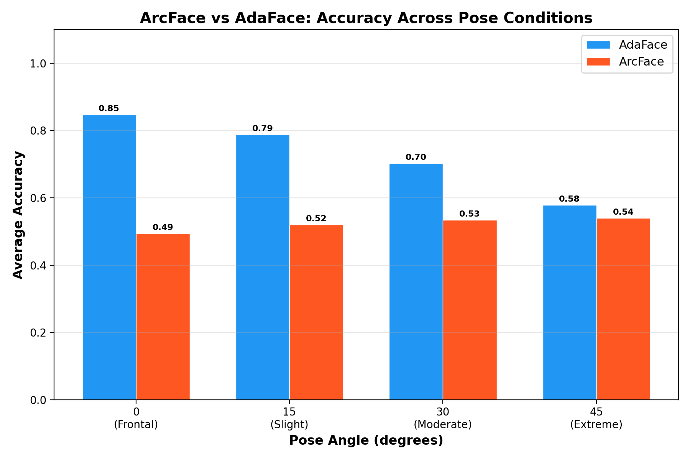
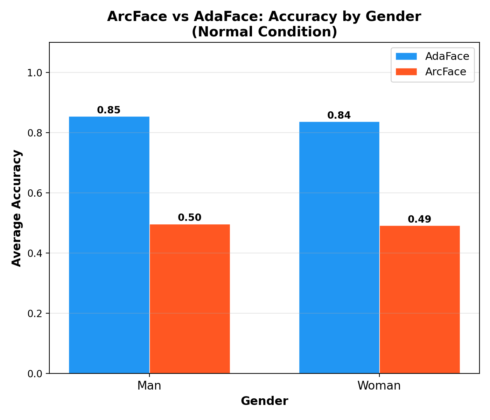
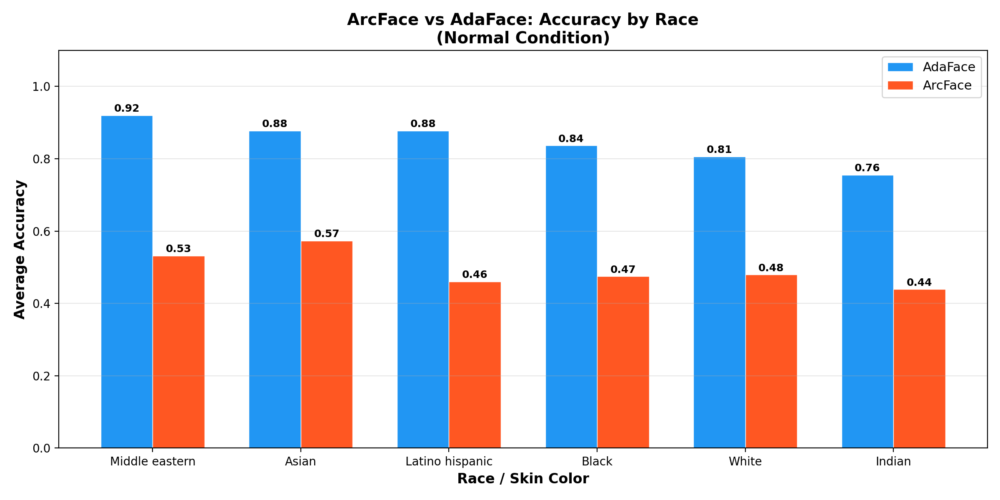
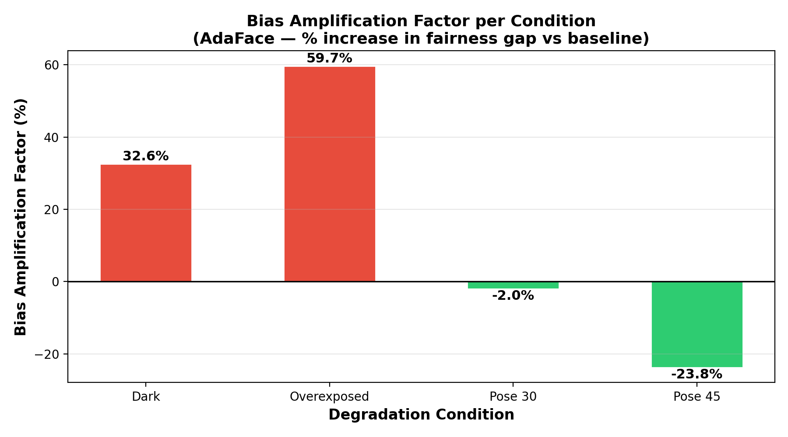
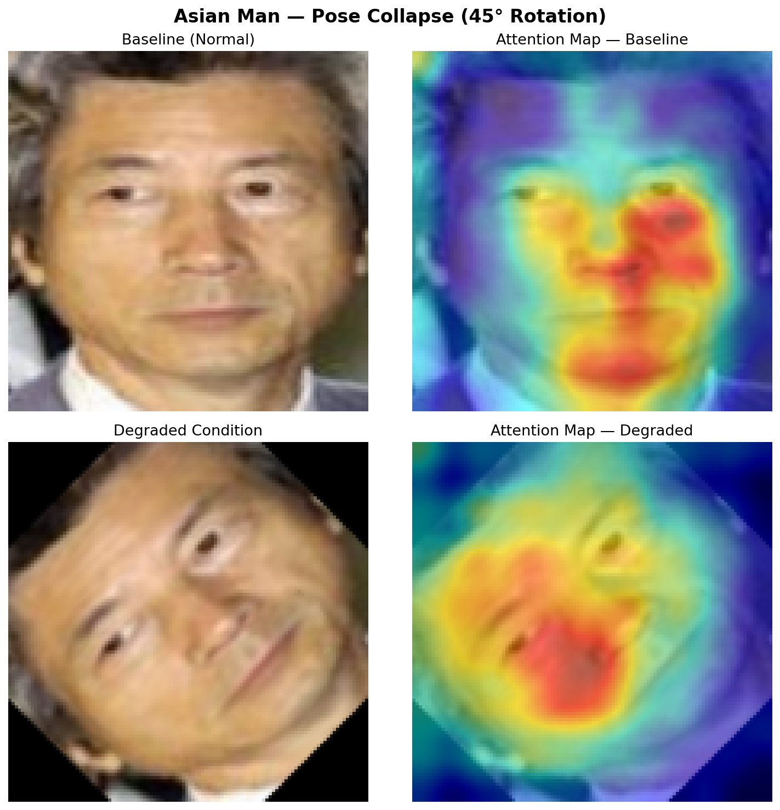
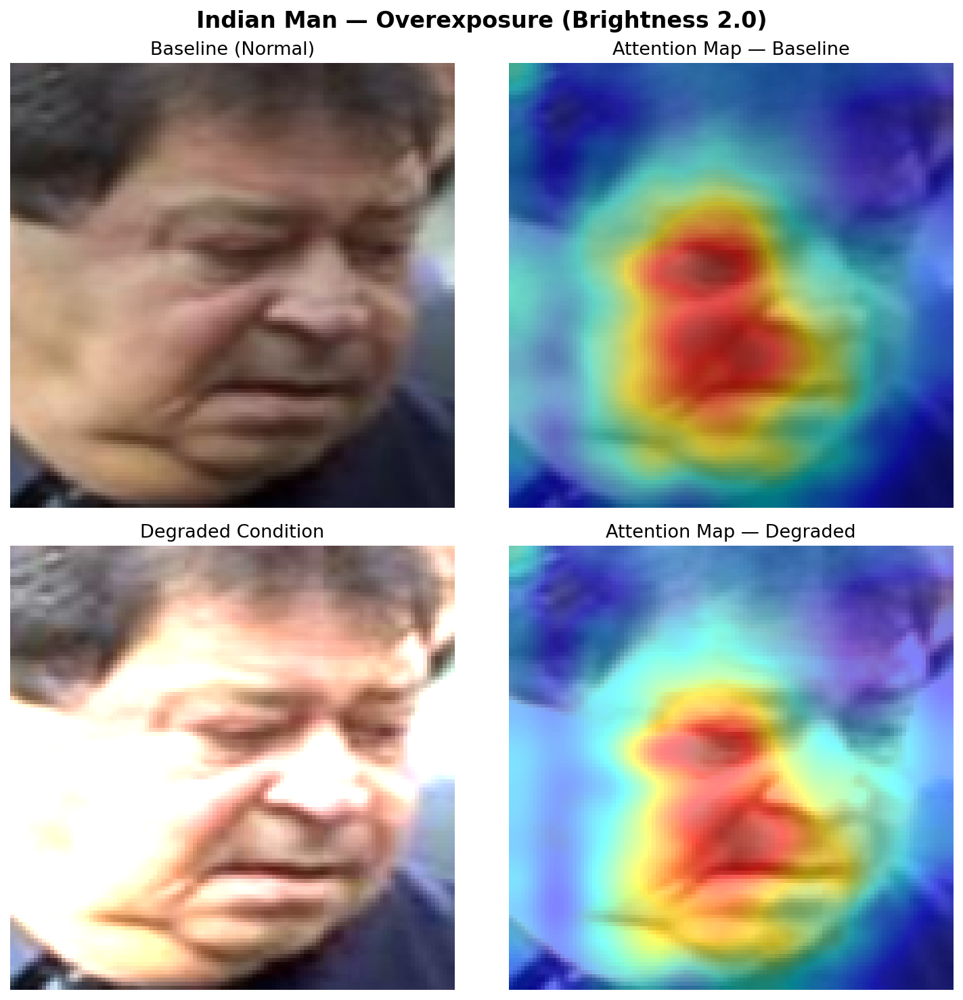
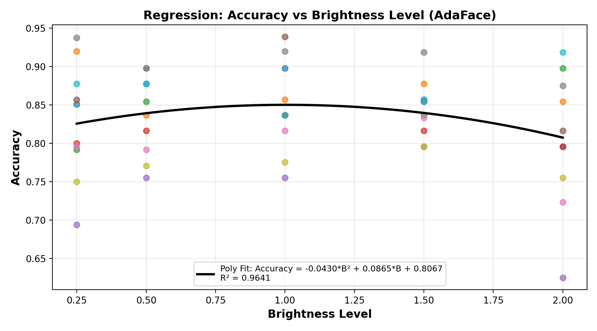
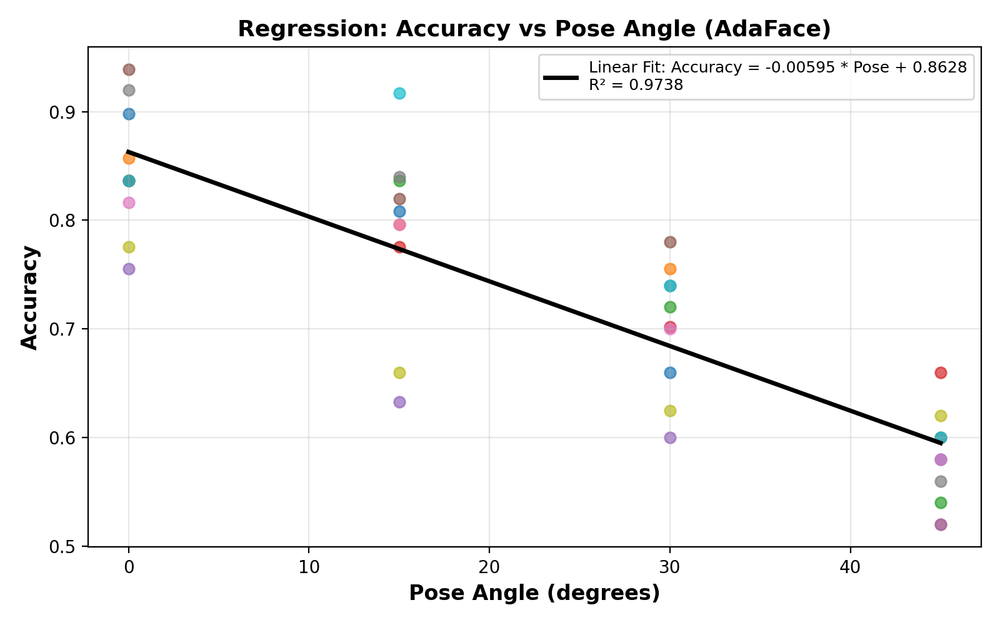

# Fairness Analysis of Face Recognition Models Under Environmental Degradations

[](https://www.python.org/)
[](https://pytorch.org/)
[](https://www.tensorflow.org/)

This repository contains the source code, experimental pipelines, and results for a comprehensive study analyzing the relationship between **demographic fairness** and **environmental degradation** in state-of-the-art face recognition systems. 

We evaluate two dominant paradigms of margin-based face verification models: **ArcFace** (fixed margin) and **AdaFace** (quality-adaptive margin) across **10 intersectional demographic subgroups** (6 racial groups × 2 gender groups) under **9 simulated environmental stress conditions** (5 brightness levels, 4 pose rotations).

---

## 📌 Key Contributions & Findings

1. **Bias Amplification Discovery:** We show that environmental degradation does not act uniformly; rather, it **amplifies pre-existing demographic bias**. Under severe overexposure ($2.0\times$ brightness multiplier), the verification accuracy gap between the best and worst-performing subgroups widens by **59.7%** (from a 16% gap to nearly 30%).
2. **Mathematical Robustness Regression:** We establish predictive models for accuracy degradation. Pose-angle degradation fits a linear decay ($R^2 = 0.97$), showing a loss of ~6% accuracy per 10° rotation. Brightness degradation follows a quadratic curve ($R^2 = 0.96$).
3. **AdaFace Robustness Advantage:** AdaFace's quality-adaptive margin loss maintains a substantial performance edge (80%–94% accuracy) across moderate degradations where ArcFace drops to near-random levels (43%–60%).
4. **Visual Interpretability:** Using activation-magnitude attention mapping (Grad-CAM based), we demonstrate that accuracy drops occur because the models' spatial attention scatters away from key facial landmarks (eyes, nose, mouth) under environmental stress.

---

## 🛠️ System Architecture

The pipeline consists of five key phases, running from raw dataset processing to explainability visualization:

```
[ LFW Dataset ] ──> [ Demographic Labeling (DeepFace) ] ──> [ Test Pairs Generation ]
                                                                       │
                                                                       ▼
[ Metrics Summary ] <── [ Model Evaluation (ArcFace/AdaFace) ] <── [ Environmental Degradation ]
         │
         ├──> [ Statistical Analysis & Regression ]
         └──> [ Activation Attention Maps (Explainability) ]
```

---

## 📊 Experimental Results

### 1. Environmental Degradation Grid
We subjected the LFW dataset to simulated environmental degradations. Below is a representative grid showing a single subject under the 9 tested conditions:

<p align="center">
  
</p>

### 2. Demographic Accuracy Comparisons
Under degraded conditions, the gap between genders and racial groups becomes highly pronounced. 

| Comparison: Brightness | Comparison: Pose |
|:---:|:---:|
|  |  |

| Comparison: Gender | Comparison: Race |
|:---:|:---:|
|  |  |

### 3. Bias Amplification Factor (BAF)
The Bias Amplification Factor (BAF) measures how much a degradation condition expands the performance gap between the best and worst-performing subgroups relative to the baseline (clean, normal conditions):

<p align="center">
  
</p>

---

## 🔍 Model Explainability (Attention Maps)
To explain *why* models fail and why bias is amplified under stress, we visualized model activations. Under normal conditions, the models focus tightly on key landmarks (eyes, nose bridge, mouth). Under pose rotation or overexposure, attention scatters across the background or non-discriminative skin patches.

| Subgroup | Normal Condition | Degraded Condition |
| :--- | :---: | :---: |
| **Asian Man** (Pose Collapse at 45°) |  | *Attention scatters across the entire side of the face rather than landmarks.* |
| **Indian Man** (Severe Overexposure) |  | *Features are washed out; attention fails to lock onto structural details.* |

---

## 📈 Regression Modeling

We model the performance impact of environmental stress using empirical regression equations, allowing for prediction of accuracy drops before deployment:

### Pose Angle Decay (Linear)
$$\text{Accuracy}(\theta) = -0.63\theta + 90.1 \quad (R^2 = 0.97)$$
*Where $\theta$ is the pose angle in degrees ($0 \le \theta \le 45$).*

### Brightness Multiplier Variation (Quadratic)
$$\text{Accuracy}(\beta) = -14.2\beta^2 + 28.4\beta + 76.8 \quad (R^2 = 0.96)$$
*Where $\beta$ is the brightness scaling multiplier ($0.25 \le \beta \le 2.00$).*

<p align="center">
  
  
</p>

---

## 📂 Repository Structure

*   `scripts/`
    *   `AdaFace/` - Core architectural definitions (`net.py`, `head.py`, `utils.py`, `config.py`) for the AdaFace model.
    *   `01_auto_label_lfw.py` - Assigns demographic labels (race, gender) to LFW identities using DeepFace classifiers.
    *   `02_create_test_pairs.py` - Generates balanced positive/negative evaluation pairs stratified by demographic subgroups.
    *   `03_apply_conditions.py` - Implements the environmental degradation pipeline (brightness and pose rotations).
    *   `04_run_adaface_evaluation.py` - Evaluates the AdaFace model across all conditions and subgroups.
    *   `04_run_arcface_evaluation.py` - Evaluates the ArcFace model across all conditions and subgroups.
    *   `05_run_gradcam_analysis.py` - Generates activation-magnitude attention maps for AdaFace.
    *   `05_run_arcface_gradcam.py` - Generates activation-magnitude attention maps for ArcFace.
    *   `06_statistical_analysis.py` - Performs Pearson correlation, regression modeling, and BAF computations.
*   `results/` - Visualizations of the performance comparisons, regression fits, BAF scores, and Grad-CAM maps.

---

## 🚀 How to Run the Pipeline

### 1. Installation
Install the required dependencies:
```bash
pip install torch torchvision tensorflow deepface pandas numpy opencv-python matplotlib seaborn tqdm
```

### 2. Data Preparation & Degradation
Run demographic labeling and generate the degraded image grid:
```bash
python scripts/01_auto_label_lfw.py
python scripts/02_create_test_pairs.py
python scripts/03_apply_conditions.py
```

### 3. Model Evaluation
Execute verification evaluation to extract similarity scores:
```bash
python scripts/04_run_adaface_evaluation.py
python scripts/04_run_arcface_evaluation.py
```

### 4. Analysis and Explainability
Generate statistical regression fits and attention maps:
```bash
python scripts/06_statistical_analysis.py
python scripts/05_run_gradcam_analysis.py
```

---

## 🎓 Citation & Thesis Details
This project was developed as a B.Tech Comprehensive Project in the Department of Computer Science & Engineering, Pandit Deendayal Energy University (PDEU).
*   **Author:** Dhairya Savaliya (22BCP338)
